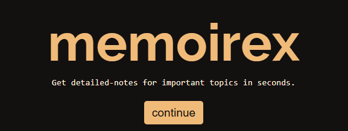
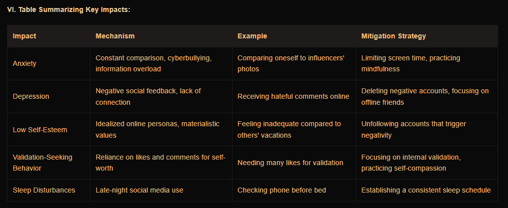

# Memoirex AI

Memoirex is a web-based application that uses Google Gemini 1.5 Flash API to generate detailed and comprehensive notes on any given topic. Designed with students and learners in mind, the app provides well-structured, easy-to-read notes to streamline the studying process.

    
    
    
    
    
<b>TECH STACK</b>

### How It Works

1. Enter a topic in the input field.
2. Click "Generate Notes" to fetch detailed notes from Memoirex.
3. View the generated notes in a markdown-friendly format.
4. Copy the notes to your clipboard or regenerate them.

**Dependencies:** [Next.js](https://nextjs.org/) - [React](https://reactjs.org/) - [TailwindCSS](https://tailwindcss.com/) - [Framer Motion](https://www.framer.com/motion/) - [React Markdown](https://github.com/remarkjs/react-markdown) - [Remark GFM](https://github.com/remarkjs/remark-gfm) - [Axios](https://axios-http.com/)

    
    
[Home Page]

       
    
    
    
[Example Notes]

     

### Contact

For questions or feedback, please reach out via:
- GitHub: [@arindal1](https://github.com/arindal1)
- LinkedIn: [Arindal Char](https://linkedin.com/in/arindalchar)

---

Start generating smarter, comprehensive notes today with **Memoirex AI**!
